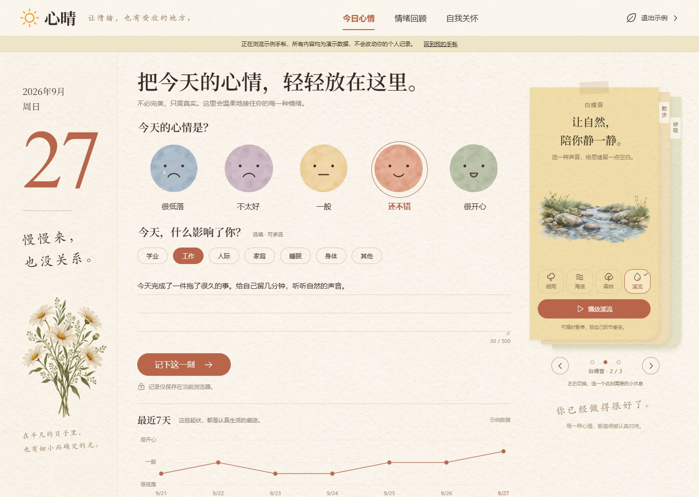
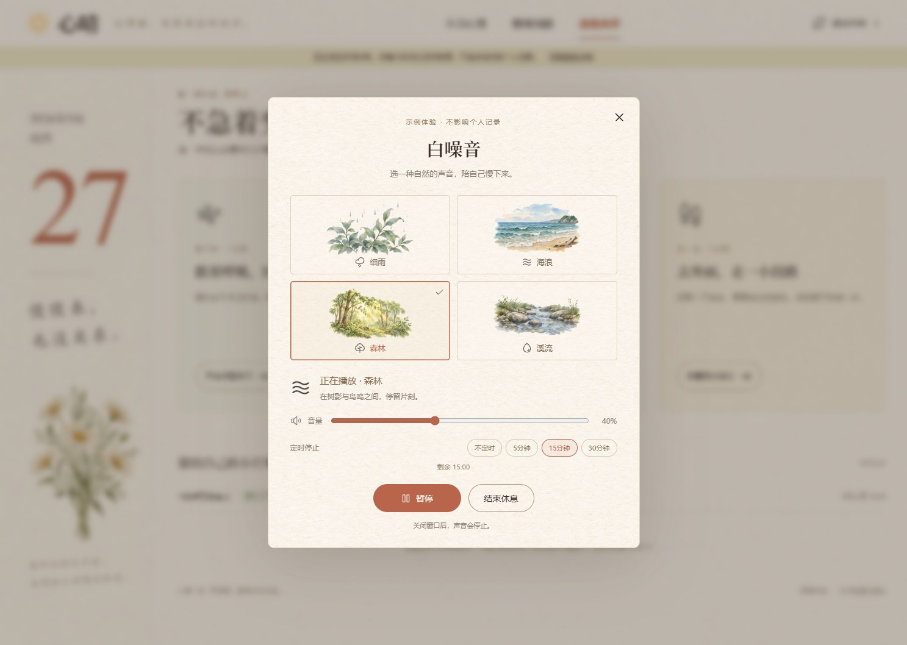

# 心晴 · 情绪日记与自我关怀

**在线体验**：[moodjournal-pi.vercel.app](https://moodjournal-pi.vercel.app/)

**产品文档**：[详细 PRD](docs/PRD.md) · [原型截图说明](docs/images/README.md) · [交互与视觉验收](design-qa.md)

心晴是一款面向年轻人的情绪日记与自我关怀工具，以温暖的数字手帐承载日常感受。用户可以从一个表情、一句话开始记录，回看情绪变化与常见情境，再通过呼吸练习、自然声或散步，给自己留一段短暂的休息时间。

> 当前为已部署、可交互的前端产品原型：日记增删改、趋势统计、自然声播放和练习计时均可实际使用。记录仅保存在当前浏览器；情绪分析采用统计、关怀推荐采用简单规则，尚未接入大模型，也不提供心理诊断。

## 原型预览

以下图片截取自实际在线原型。带有「示例手帐 / 示例数据」标记的内容为演示数据，不代表真实用户记录或产品效果验证。点击图片可查看大图。

### 产品概览

| 今日心情：低门槛记录 | 情绪回顾：看见变化与线索 |
|---|---|
|  |  |

记录时只需选择一个心情，影响因素和文字均可选填。同一天允许多次记录，回顾页展示最近 7 天的每日均值，并整理低落记录中常出现的标签。

### 自我关怀

| 关怀入口与活动记录 | 四种自然声与播放控制 |
|---|---|
|  |  |

提供 1 分钟呼吸练习、细雨 / 海浪 / 森林 / 溪流四种自然声，以及 5 分钟散步引导。用户可以暂停、提前结束，并选择是否记录活动后的感受。

### 首页关怀便签

| 呼吸 · 1 / 3 | 白噪音 · 2 / 3 | 散步 · 3 / 3 |
|---|---|---|
|  |  |  |

三张纸质便签向右依次叠放，支持箭头、圆点、分类边签、键盘和手机滑动。圆点固定对应「呼吸 → 白噪音 → 散步」，选中状态、页码与切换顺序一致；白噪音插画随声音选择同步变化。

### 移动端

| 今日心情 | 自然声播放器 |
|---|---|
|  |  |

桌面采用日期侧栏、记录区与关怀便签布局；手机端重排为单列，保留核心记录与关怀操作。

## 产品背景

情绪波动发生时，用户未必有精力写长篇日记，也可能不知道如何开始照顾自己。本项目从以下需求假设出发，将「记录—回看—行动」缩短为可以随时开始的轻量流程；这些假设尚未经过正式用户研究验证。

| 用户问题 | 产品机会 |
|---|---|
| 想记录，但不知道写什么、没有精力写很多 | 五档表情单选，标签和一句话日记选填，只选心情也能保存 |
| 记过之后很少回看，难以发现重复情境 | 最近 7 天趋势 + 低落时常出现的影响因素 + 可编辑的历史日记 |
| 知道自己需要休息，却不知道先做什么 | 在首页直接提供呼吸、自然声和散步入口，按当前选择给出规则建议 |
| 不希望私密情绪被公开，也不想额外注册 | 无需账号，当前浏览器本地存储；明确说明数据保存范围 |
| 打卡和坚持目标可能带来额外负担 | 不设置连续天数、积分或完成压力，允许随时停止与跳过反馈 |

## 目标用户与核心流程

**核心用户**：希望低成本记录日常情绪、理解压力情境，并尝试短时自我调节的学生与职场年轻人。

```text
选择此刻心情 → 可选记录影响因素与一句话 → 保存日记
                                      ↓
回顾七天变化与历史记录 ← 选择关怀活动 → 记录活动后感受
```

用户也可以直接进入「自我关怀」，无需先写日记；首次体验可使用与个人数据隔离的示例手帐。

## 产品方案

| 子界面 | 用户任务 | 方案设计 | 核心输出 |
|---|---|---|---|
| 今日心情 | 快速表达此刻感受 | 五档心情、七类影响因素、500 字内日记、即时保存反馈 | 一条可回看的情绪记录 |
| 情绪回顾 | 理解最近的变化 | 七天每日均值、低落因素出现次数、倒序日记与编辑删除 | 趋势与情境线索，不推断因果 |
| 首页便签 | 找到适合当下的小休息 | 三张右侧叠放便签、固定圆点顺序、依据心情与标签的规则推荐 | 呼吸 / 白噪音 / 散步入口 |
| 自我关怀 | 实际进行一次短时休息 | 呼吸节奏、自然声音频、散步步骤、暂停与结束 | 可自主控制的练习过程 |
| 活动反馈 | 看见照顾自己的片刻 | 好一点了 / 差不多 / 更难受了 / 跳过，展示最近关怀记录 | 活动类别、时间与自我感受 |
| 示例与隐私 | 放心试用并理解数据边界 | 示例数据隔离、可恢复的页面草稿、明确的存储说明 | 无需注册的完整体验 |

详细字段、状态流转、统计与推荐规则、异常处理、验收用例和后续规划见 [PRD](docs/PRD.md)。

## 设计与迭代

- **暖色手帐**：用纸张纹理、水彩表情、植物插画和陶土色按钮，承接记录场景；减少评判式、任务式文案。
- **自然的空状态**：没有记录时露出页面纸纹，保留开始入口，不填充虚构曲线或将空白日当作低落。
- **从雨声到自然声**：扩展为四种声音，补充真实音频、音量、暂停继续、定时停止和来源说明。
- **更清晰的便签切换**：从双侧露边调整为右侧叠放，隐藏后方正文，只保留分类边签；三个圆点与内容顺序统一。
- **插画与选择同步**：图片预加载，只有当前选中且已就绪的插画会显示；失败时提示重试，选中项增加勾选标记。

## 当前能力与产品边界

- 日记和关怀反馈保存在 `localStorage`，不上传日记内容，不跨设备、浏览器或域名同步；清理浏览器数据可能丢失记录。
- 示例手帐只用于演示，新增、修改和练习反馈均与个人记录隔离。
- 情绪小结根据用户记录统计；推荐由标签与心情规则驱动，未接入 AI 对话、文本情绪识别或在线模型服务。
- 白噪音在产品中指四类自然环境声；音频文件随站点部署，页面不会自动播放，关闭练习窗口后停止。
- 项目用于日常情绪记录与自我关怀，不替代专业心理服务；尚无真实用户规模、留存或改善效果数据。

## 产品设计与实现

围绕「低门槛记录、理解情绪变化、随时开始自我关怀」三个目标，完成需求梳理、功能取舍、信息架构、视觉设计、交互实现与上线部署。通过实际页面体验持续优化空状态、自然声选择和便签切换，让记录与关怀形成连贯的使用流程。

开发过程使用 AI 辅助编码与素材生成，水彩和纸张等视觉素材由 Image Gen 生成。当前产品的统计与推荐由明确的代码规则实现，运行时不调用大模型。

## 技术说明

- HTML、CSS、原生 JavaScript，前端运行无需框架依赖。
- Canvas 绘制情绪趋势，`localStorage` 保存本地记录，HTML Audio 播放自然声。
- Node.js 内置测试与静态构建脚本；独立 Chrome / agent-browser 验证实际交互。
- GitHub `main` 分支联动 Vercel，沿用固定公开域名。

```text
index.html                 页面与弹窗结构
styles.css / care.css      手帐视觉、便签与响应式布局
journal.js                 记录校验、日期聚合、标签统计、推荐规则
app.js                     表单、页面、存储、趋势与活动反馈
care.js / nature-audio.js   便签、声音选择、播放与计时生命周期
assets/                    本地插画、图标、音频及授权说明
docs/PRD.md                详细产品需求文档
docs/images/               实际原型截图
tests/                     核心逻辑与浏览器验证脚本
```

## 本地运行

安装 Node.js 后，在项目目录执行（无需安装依赖）：

```bash
npm run dev
```

访问 `http://127.0.0.1:4173`。也可保留全部资源后直接打开 `index.html`，建议使用本地服务预览。

## 质量检查

```bash
npm run check
npm test
npm run build
```

- 9 项自动测试覆盖记录校验、七天统计、因素统计、数据读取、示例数据、推荐与音频生命周期。
- 浏览器脚本覆盖日记增删改、示例隔离、实际音频播放、练习计时、便签顺序、插画失败重试和响应式布局。
- 使用 `tests/browser-check.cjs`、`tests/care-browser-check.cjs`、`tests/stack-browser-check.cjs` 前，需启动服务并设置 `AGENT_BROWSER_BIN`；`TEST_URL` 默认为 `http://127.0.0.1:4174`，使用默认开发端口时应改为 `http://127.0.0.1:4173`。
- 已验证的范围与截图证据见 [验收记录](design-qa.md)，不代表已完成所有浏览器、设备或真实用户环境测试。

## 部署与素材

Vercel 执行 `node build.cjs`，发布 `dist/` 中的静态页面与资源。后续迭代沿用当前项目和域名：[moodjournal-pi.vercel.app](https://moodjournal-pi.vercel.app/)。

水彩插画、纸张和表情由 Image Gen 生成；通用图标来自 [Phosphor Icons](https://github.com/phosphor-icons/core)，许可见 [MIT License](assets/icons/LICENSE)。自然声音频作者、来源与许可见 [声音来源](assets/audio/CREDITS.html)。
