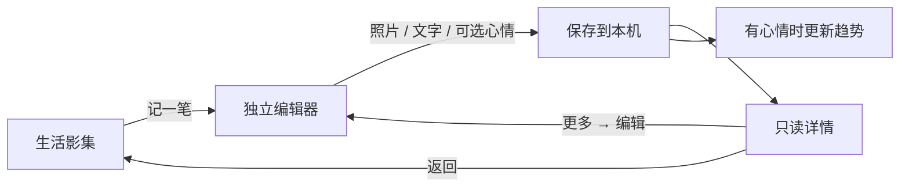

# 心晴 · 情绪日记与自我关怀

一本从一个表情、一句话、一张照片开始的数字手帐。记录日常感受，收藏生活与旅行片刻，回看情绪变化，再给自己一点休息时间。

**在线体验**：[moodjournal-pi.vercel.app](https://moodjournal-pi.vercel.app/) · **安卓安装**：[APK 安装与构建](docs/ANDROID.md)

**产品文档**：[完整 PRD](docs/PRD.md) · [v1.1 照片手帐 PRD](docs/PHOTO-JOURNAL.md) · [视觉与交互验收](design-qa.md)

> 当前版本 v1.1：图文日记、情绪统计与自然声可实际使用。无需注册，记录保存在当前浏览器或 App；支持手动备份和恢复，不会自动跨设备同步。情绪分析采用统计，关怀建议采用简单规则，未接入大模型。

## v1.1：把日子，收进相册

这次迭代围绕「拍了生活或旅游照片，也想留下一句话或一篇日记」展开。**浏览、阅读、编辑是三个独立界面**：相册专注照片，详情专注阅读，点击「记一笔」或详情「更多 → 编辑」才进入编辑器。

| 生活影集 | 独立编辑页 | 只读详情 |
|---|---|---|
|  |  |  |


以上为实际实现的浏览器截图，内容是隔离测试环境中的虚构日记与生成照片，不是用户私人数据。完整截图说明见 [图片目录](docs/images/README.md)。

| 能力 | 已实现的行为 |
|---|---|
| 图文记录 | 每篇最多 9 张照片、5,000 个正文字符、40 个标题字符；心情可选 |
| 照片管理 | 预览大图、前后翻看、前移/后移、设为封面、移除；不修改相册原文件 |
| 独立写作 | 纯文字、纯照片、只选心情均可保存；支持选择今天或过去日期 |
| 草稿恢复 | 图文编辑器自动保存本机草稿，刷新可恢复；新建与各篇编辑草稿分开 |
| 阅读回顾 | 日期倒序，首篇大图、后续双列；支持「全部记录 / 有照片」筛选 |
| 情绪联动 | 有心情的图文记录参与七天统计；未填心情不计为低落或一般 |
| 备份恢复 | JSON 包含日记文字和实际照片；导入前预览，已有 ID 保留本机版本 |
| 旧数据兼容 | 首次升级将旧日记迁入 IndexedDB，保留旧 localStorage 原始数据 |

## 情绪记录与自我关怀

| 今日心情 | 自我关怀 |
|---|---|
|  |  |

上图为 v1.0 已上线功能的历史截图；v1.1 保留主线，并新增照片日记入口与独立影集。

- **今日心情**：五档心情、七类影响因素、500 字内快捷记录；只选表情也能保存。
- **情绪回顾**：最近七天每日均值，以及低落记录中出现的标签。无记录的日期保持空白，不将相关性说成原因。
- **呼吸与散步**：1 分钟自然呼吸引导、5 分钟散步建议，可暂停和提前结束。
- **自然声**：细雨、海浪、森林、溪流，支持音量、暂停继续、定时停止；选声音时插画同步变化。
- **关怀便签**：三张纸向右依次叠放，圆点固定对应「呼吸 → 白噪音 → 散步」，支持箭头、边签、键盘及手机滑动。
- **独立示例**：内置演示数据与个人手帐隔离，可放心体验新增、编辑和关怀反馈。

## 产品设计

| 场景 | 设计取舍 |
|---|---|
| 情绪波动时不想填复杂表单 | 首页继续保持低门槛，表情即可记录 |
| 生活随拍后想写几句，旅行后想写长文 | 一份图文记录支持不同篇幅，心情和标题可选 |
| 回看时不想看见上传框和表单 | 相册、详情、编辑分开，列表没有照片管理控件 |
| 照片不一定代表某种情绪 | 不识别照片情绪，不自动填写心情，不污染趋势 |
| 不想注册或公开自己的日记 | 本机存储、手动备份，清楚说明设备间的数据边界 |



视觉延续米白纸纹、衬线标题、陶土色按钮、水彩心情与薄纸相框。设计参考、实现对照及验收记录见 [设计档案](docs/iterations/photo-journal/DESIGN.md) 和 [design-qa.md](design-qa.md)。这些需求仍是设计假设，尚无真实用户研究、留存或改善效果数据。

## 数据与能力边界

- 日记、照片和图文草稿保存在 **IndexedDB**；关怀反馈保存在 `localStorage`。没有上传日记的服务器接口，也没有账号、加密保险箱或云同步。
- 网页与 App、不同浏览器、不同设备各自保存数据。备份文件可手动转移；同 ID 导入时跳过，不覆盖本机编辑，也不进行冲突合并。
- 备份仅包含**已保存日记及照片**，不包含草稿和关怀反馈；本版支持 100 MB 以内的 JSON 文件。备份是明文文件，请自行妥善保存。
- 单张导入照片不超过 20 MB / 5,000 万像素；应用副本最长边压缩至 1,800px，移除元数据，原图不变。HEIC 是否能导入取决于设备解码能力。
- 清除浏览器/应用数据、无痕模式或卸载可能丢失记录；先导出重要日记。安卓版仍使用 WebView 的 IndexedDB，并非原生数据库。
- 安卓 v1.1 测试包名为「心晴·影集」，可与旧版并存，二者数据独立；测试签名不保证后续覆盖安装。相机、系统分享及返回键仍需实机确认。
- 本项目提供日常记录与自我关怀，不提供诊断或专业咨询，也不宣称调节效果。

## 技术与目录

HTML、CSS、原生 JavaScript；Canvas 绘制趋势，HTML Audio 播放本地自然声，Capacitor 打包 Android。运行时不依赖在线模型服务。

```text
index.html                 页面与弹窗
styles.css / care.css      原有手帐与自我关怀样式
album.css / album.js       影集、独立编辑器、照片查看、草稿与备份入口
journal.js                 记录校验、日期、统计、推荐规则
journal-store.js           IndexedDB 事务、旧数据迁移、图文备份
app.js                     页面路由、心情表单、统计、关怀反馈
care.js / nature-audio.js   便签与自然声播放
android/                   Capacitor 安卓工程
assets/                    本地图片、音频、图标与许可
scripts/verify-apk.py       APK 内置资源与插件校验
tests/                     核心逻辑和浏览器回归
docs/                      PRD、实际截图、设计与安装说明
```

## 开发与验证

需要 Node.js 22+。在项目目录运行：

```bash
npm ci
npm run dev
```

打开 `http://127.0.0.1:4173`。请使用 HTTP 本地服务，以获得正确的浏览器存储和资源加载环境。

```bash
npm run check
npm test
npm run build
npm run android:sync
```

10 项单元测试覆盖记录、日期、统计和音频状态。真实 Chromium 回归包含旧数据迁移、上传、刷新恢复、排序封面、长文编辑、失败保留、示例隔离、备份还原、删除及原有心情/自然声流程。

浏览器脚本需要启动本地服务，并设置 `AGENT_BROWSER_BIN`、`TEST_URL`；使用独立测试会话，脚本会清理该测试会话的测试日记数据。运行 `node tests/album-browser-check.cjs` 或 `node tests/care-browser-check.cjs`。实际验证范围和未验证项见 [验收记录](design-qa.md)。

## 部署与素材

GitHub `main` 分支联动原 Vercel 项目，构建 `node build.cjs`，发布 `dist/`，沿用 [固定公开域名](https://moodjournal-pi.vercel.app/)。Android 工作流手动生成 APK，操作见 [安装与构建文档](docs/ANDROID.md)。

纸纹、水彩插画和演示照片由 Image Gen 生成；照片均为虚构素材。图标来自 [Phosphor Icons](https://github.com/phosphor-icons/core)，Capacitor 桥接代码使用 MIT 许可。详见 [素材说明](assets/CREDITS.md)、[图标许可](assets/icons/LICENSE)、[Capacitor 许可](assets/CAPACITOR-LICENSE) 和 [声音来源](assets/audio/CREDITS.html)。