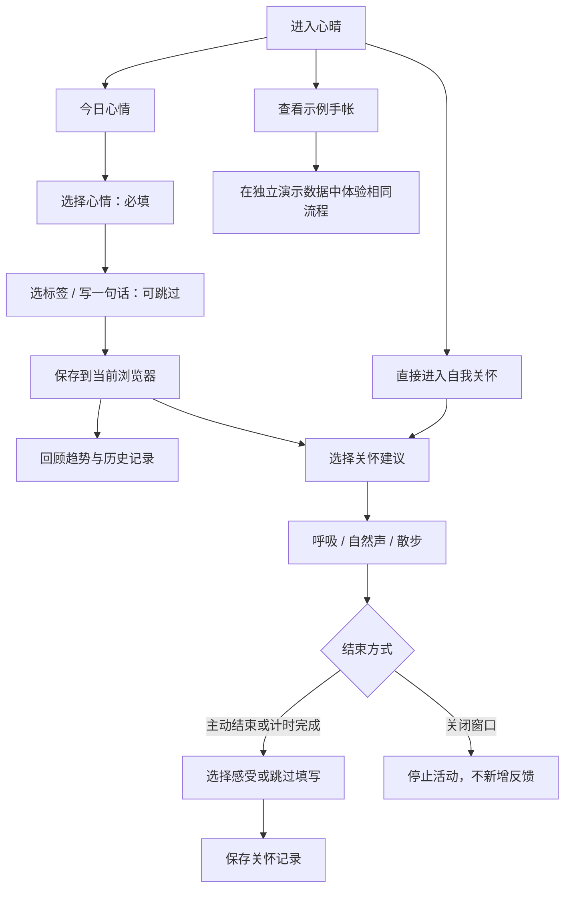
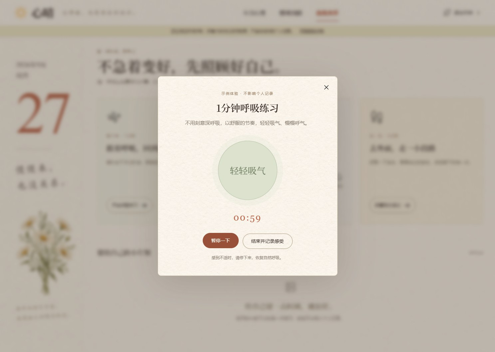

# 心晴 · 情绪日记与自我关怀 PRD

[返回项目首页](../README.md) · [在线原型](https://moodjournal-pi.vercel.app/) · [截图说明](images/README.md) · [验收记录](../design-qa.md)

| 文档项 | 内容 |
|---|---|
| 文档版本 | V1.1.1 · 情绪主线与照片手帐 |
| 更新日期 | 2026-09-27 |
| 产品方向 | 情绪记录、变化回顾与日常自我关怀 |
| 功能基线 | `c6fc23e`，包含四种自然声、右侧叠放便签与插画同步修复 |
| 产品状态 | 已部署的前端原型；本地记录和实际音频可使用，无账号与云端数据库 |
| 文档口径 | 「已实现」基于当前代码与实际原型；用户需求为设计假设；指标和后续规划尚未验证或上线 |

v1.1 新增独立影集、图文编辑器、照片管理、草稿与备份恢复。完整规则见 [照片手帐 PRD](PHOTO-JOURNAL.md)，与本文共同构成当前需求。下方首页、关怀与旧回顾截图为 v1.0 历史证据，新界面截图见补充 PRD。

## 目录

- [1. 产品定位与背景](#1-产品定位与背景)
- [2. 目标用户与使用场景](#2-目标用户与使用场景)
- [3. 目标与版本范围](#3-目标与版本范围)
- [4. 信息架构与核心流程](#4-信息架构与核心流程)
- [5. 功能需求与交互规则](#5-功能需求与交互规则)
- [6. 数据模型与业务口径](#6-数据模型与业务口径)
- [7. 关键异常与空状态](#7-关键异常与空状态)
- [8. 视觉响应式与可访问性](#8-视觉响应式与可访问性)
- [9. 隐私与产品边界](#9-隐私与产品边界)
- [10. 验收标准](#10-验收标准)
- [11. 产品验证与指标规划](#11-产品验证与指标规划)
- [12. 后续迭代与交付](#12-后续迭代与交付)

## 1. 产品定位与背景

**一句话定位**：一本无需注册、可以从一个表情开始的情绪手帐，让年轻人在记录感受后，顺手给自己一点关怀。

心晴关注年轻人在学业、职场和社交压力下的日常情绪记录需求，希望降低表达感受和开始自我关怀的门槛。产品围绕「表达—回看—行动—反馈」组织体验，让用户可以快速记下一刻心情、发现值得留意的情境，并自主选择适合当下的小休息。当前版本先完成基本使用流程，再通过后续用户验证完善方案。

以下为本项目的设计假设，尚无用户访谈、问卷或量化实验支撑：

| 需求假设 | 对应设计 | 希望验证的问题 |
|---|---|---|
| 情绪低落时不愿投入很多精力填写 | 只选心情即可保存，文字和标签选填 | 用户能否不经说明完成第一条记录？ |
| 仅有日记列表不易看到变化 | 七天趋势和影响因素统计 | 用户是否能正确理解均值、缺失日与关联？ |
| 记录后缺少下一步行动 | 首页提供三种短时关怀建议 | 用户能否找到愿意尝试的活动？ |
| 情绪隐私和登录成本影响开始意愿 | 本地存储、无需账号、独立示例 | 用户是否理解数据保存与丢失边界？ |
| 打卡目标可能增加负担 | 允许暂停、提前结束和跳过反馈 | 用户是否感到可控、没有被要求完成任务？ |

### 产品原则

1. **容易开始**：减少必填项，先支持表达，不要求解释原因。
2. **如实呈现**：没有记录就展示空状态，不生成虚构趋势，不将标签关联说成原因。
3. **自主选择**：建议可以切换，活动可以中途停止，不以积分或连续打卡施压。
4. **边界清楚**：说明统计、推荐与数据存储方式，不暗示具备诊断或治疗能力。

## 2. 目标用户与使用场景

| 用户类型 | 典型情境 | 核心任务 | 本版支持 |
|---|---|---|---|
| 学生 | 作业、考试、实习等事情集中，感到烦躁或疲惫 | 快速标记情绪，写一句话，短暂休息 | 心情记录、学业标签、呼吸 / 散步 |
| 初入职场的年轻人 | 工作压力、沟通受挫、下班后思绪仍然紧张 | 看见近期变化，找到常见情境，选择放松方式 | 七天回顾、工作 / 人际标签、自然声 |
| 有轻量记录习惯的人 | 不想维护复杂日记，也不想公开分享 | 保留私密记录并偶尔回看 | 本地日记、历史编辑、隐私说明 |
| 首次访问的体验者 | 没有记录，想了解产品完整流程 | 在不填写私人内容的情况下体验 | 示例手帐、演示趋势、独立示例反馈 |

以上为场景化用户假设，年龄、职业分布和使用频次尚未通过研究确认。

**典型用户故事**：

- 作为正在赶作业的学生，我希望只点一个表情就能保存，以便在没有精力写文字时也能记录感受。
- 作为近期工作压力较大的用户，我希望回看哪些日子感到低落、记录过哪些因素，以便发现值得留意的情境。
- 作为想休息片刻的用户，我希望听到喜欢的自然声音，并能调节音量、暂停和定时停止。
- 作为第一次体验的用户，我希望明确知道哪些是示例，以及操作是否会改变自己的记录。

## 3. 目标与版本范围

### 3.1 本版目标

- 形成可真实操作的记录、回顾、关怀与反馈流程。
- 使用一个固定、公开的部署链接，支持持续更新后继续访问。
- 通过示例手帐展示完整结构，同时保持个人记录独立。
- 让桌面和手机用户都能完成主要任务。

这些是设计和交付目标，不代表已经获得留存、转化或情绪改善数据。

### 3.2 功能优先级

P0 表示基础流程必需，P1 表示体验增强；优先级不等于未来承诺。下表所有「已实现」均属于当前原型。

| 编号 | 模块 | 优先级 | 当前状态 |
|---|---|---|---|
| F01 | 五档心情、影响因素、短日记、新增保存 | P0 | 已实现 |
| F02 | 七天趋势、低落因素线索、日记编辑删除 | P0 | 已实现 |
| F03 | 首页三张关怀便签、规则推荐与一致的切换顺序 | P1 | 已实现 |
| F04 | 1 分钟呼吸引导 | P0 | 已实现 |
| F05 | 四种自然声、音量、暂停继续、定时停止 | P0 | 已实现 |
| F06 | 5 分钟散步引导 | P0 | 已实现 |
| F07 | 活动后反馈、关怀记录 | P0 | 已实现 |
| F08 | 示例手帐、个人数据隔离、存储提示 | P0 | 已实现 |
| F09 | 响应式布局、图片预加载与失败重试 | P1 | 已实现 |
| F10 | 独立影集、图文编辑、9 张照片、长日记、补记日期 | P0 | v1.1 已实现 |
| F11 | 图文草稿、旧记录迁移、图文 JSON 备份恢复 | P0 | v1.1 已实现 |

### 3.3 本版不包含

账号注册、云端同步、社交分享、消息提醒、日记全文搜索、实时 AI 对话、日记文本情绪识别、心理测评或专业咨询预约均未实现。未来范围应以进一步验证后的需求为准。

## 4. 信息架构与核心流程

```text
心晴
├─ 今日心情 #today
│  ├─ 五档心情 / 影响因素 / 一句话日记
│  ├─ 关怀便签：呼吸、白噪音、散步
│  ├─ 最近 7 天趋势
│  └─ 图文入口 → 独立编辑 #write
├─ 情绪回顾 #review
│  ├─ 七天趋势
│  ├─ 情绪背后的小线索
│  └─ 我的手帐 #album → 详情 #entry/:id → 编辑 #edit/:id / 确认删除
├─ 自我关怀 #care
│  ├─ 呼吸 / 自然声 / 散步活动弹窗
│  ├─ 活动后反馈
│  └─ 最近关怀记录
└─ 全局入口
   ├─ 查看示例 / 退出示例
   ├─ 数据与隐私说明
   └─ 声音来源
```



写日记不是进入关怀的前置条件。推荐不会锁定活动选择，用户可以自行切换到任何一种关怀方式。

## 5. 功能需求与交互规则

### 5.1 F01：今日心情与日记记录


**入口**：默认首页、顶部「今日心情」。这里是 500 字快捷情绪记录；相册「记一笔」进入独立图文编辑器，规则见照片手帐 PRD。

| 字段 / 操作 | 规则 | 反馈 |
|---|---|---|
| 心情 | 必填单选：很低落 / 不太好 / 一般 / 还不错 / 很开心，对应 1–5 | 表情和标签出现选中状态；未选择时不能保存 |
| 影响因素 | 选填多选：学业、工作、人际、家庭、睡眠、身体、其他 | 可重复点击取消；仅保留合法、去重标签 |
| 一句话日记 | 选填，最多 500 个输入字符；保存前去除首尾空白 | 显示字数；不要求填写完整事件或原因 |
| 记下这一刻 | 校验通过后新增记录；一天可以记录多次 | 保存成功提示、表单重置、趋势和列表更新 |
| 日期 | 快捷入口使用今天 | 图文编辑器可补记过去日期 |
| 编辑 | 我的手帐 → 详情 → 更多 → 编辑 | 独立编辑器保留原 ID / 创建时间，可调整记录日期 |
| 取消编辑 | 退出本次编辑 | 不修改已保存内容 |

**状态要求**：

- 初次进入不替用户选择心情；只选心情、保持标签与文字为空也能保存。
- 未选择心情时提示「先选一个最接近此刻的心情吧」，焦点返回心情控件。
- 保存失败时保留当前输入，不显示成功，不用失败数据覆盖页面中的已保存列表。
- 成功保存后根据刚刚记录的心情与标签切换关怀建议，不自动播放声音或开始练习。
- 页面内切换示例与个人手帐时分别保留草稿及编辑身份；该快捷入口的未保存草稿不会跨刷新持久化；独立图文编辑器草稿会在本机保存。
- 文字作为纯文本展示，用户输入的 HTML 不会被当作可执行页面内容。

### 5.2 F02：情绪回顾


**入口**：顶部「情绪回顾」打开趋势；首页「翻看我的手帐」打开独立影集。两个回顾方式可通过二级导航切换。

**七天趋势**：

1. 范围为设备本地日期的今天及之前 6 天，按日期从早到晚展示。
2. 一天只对填写了有效心情（1–5）的记录计算算术平均数：`当日有效心情之和 / 当日有效心情记录数`；未填写心情的图文日记不进入分母。
3. 无记录日使用空值，不画该日点位，曲线在缺失日断开，不把缺失补成 0、1 或相邻值。
4. 图表提供文字可读的日期、均值与条数描述；1–5 分仅用于用户自评的视觉聚合，不是测评得分。
5. 最近七天没有记录时显示引导文案与纸纹空背景；更早的记录仍保留在历史列表中。

**情绪背后的小线索**：

- 样本仅包含最近七天心情为 1 或 2 的记录。
- 每条记录中的同一标签只计一次；一条记录可同时计入多个标签。
- 按出现次数降序展示；条形长度相对最高次数，不是所有记录的占比。并列不表示不同程度的影响。
- 文案采用「低落记录中，有多少条提到某因素」的表达，避免「该因素导致低落」的结论。
- 有低落记录但无标签时，引导下次可尝试选择因素；没有低落样本时不生成推测。

**历史日记**：

- 全部记录集中在「我的手帐」，按记录日倒序，同日按创建时间倒序。
- 有图显示同篇单图、双图或三图拼贴，无图显示文字；每篇在手机和电脑都独占一行，避免相邻图文归属混淆。可筛选全部记录 / 有照片。
- 点击卡片进入只读详情，通过「更多」编辑或删除；删除二次确认，取消保留。
- 成功修改或删除后更新列表、趋势与统计；无回收站、全文搜索或分页。
- 图文编辑、草稿及备份规则见 [照片手帐 PRD](PHOTO-JOURNAL.md)。

### 5.3 F03：首页关怀便签与规则推荐

| 呼吸 | 白噪音 | 散步 |
|---|---|---|
|  |  |  |

**展示规则**：当前便签完整显示，另外两张纸向右、向下依次错开；后方正文、图片和动作按钮隐藏，仅露出纸边与分类标签。隐藏内容不进入键盘焦点序列。

**统一顺序**：

| 当前便签 | 高亮圆点 / 页码 | 右侧最近一张 | 右侧最远一张 |
|---|---|---|---|
| 呼吸 | 第 1 点 · 1 / 3 | 白噪音 | 散步 |
| 白噪音 | 第 2 点 · 2 / 3 | 散步 | 呼吸 |
| 散步 | 第 3 点 · 3 / 3 | 呼吸 | 白噪音 |

- 三个圆点从左到右固定对应呼吸、白噪音、散步，不随当前纸张移动而改变身份。
- 下一张按上述顺序循环，上一张反向循环；点击右侧最近的边签与「下一张」结果相同。
- 支持圆点直达、分类边签、左右箭头、焦点位于便签区域时的键盘方向键，以及手机水平滑动。
- 圆点、页码、当前便签、侧签与可操作内容必须同步更新。

**推荐规则**按以下顺序匹配，首次无输入时默认展示散步：

| 优先级 | 条件 | 展示便签 |
|---|---|---|
| 1 | 选中「睡眠」 | 白噪音 |
| 2 | 选中「工作」或「学业」 | 散步 |
| 3 | 以上均不满足，心情为很低落或不太好 | 呼吸 |
| 4 | 其余情况 | 散步 |

推荐随心情 / 标签变化以及保存记录更新，不分析正文。白噪音推荐仅选择活动类型，不强制改成某一种声音；用户仍可选择任何自然声。该规则是原型中的交互建议，未验证其调节效果。

### 5.4 F04：呼吸练习



| 项目 | 规则 |
|---|---|
| 入口 | 首页呼吸便签、自我关怀呼吸卡片 |
| 初始状态 | 显示「准备好了」与 01:00，等待用户点击开始 |
| 节奏引导 | 视觉上约每 4 秒切换吸气 / 呼气提示，鼓励按舒服的节奏自然呼吸 |
| 计时 | 1 分钟；暂停冻结计时，继续从剩余时间恢复 |
| 提前结束 | 可以随时进入反馈，不要求完成全部时长 |
| 自动完成 | 倒计时为 0 时停止，进入反馈 |
| 关闭弹窗 | 停止活动，不自动新增关怀记录 |

节奏仅为轻量视觉引导，不要求用户强行跟随；界面保留不适时停止的提示。

### 5.5 F05：自然声播放器


**声音范围**：细雨、海浪、森林、溪流。产品使用「白噪音」作为功能名称，实际内容为自然环境音频，不宣称为严格声学意义上的白噪声。

| 控件 / 场景 | 规则 |
|---|---|
| 默认选择 | 首次默认海浪；同一次页面使用中保留当前选择 |
| 首页声音选项 | 单选；选中项显示强调边框、底色与勾选，悬停不能伪装成已选中 |
| 选择声音 | 同步插画、按钮名称、弹窗选项；单纯选择不自动播放 |
| 首页「播放某声音」 | 明确的播放动作：打开弹窗并尝试播放所选声音 |
| 关怀页「选择白噪音」 | 打开选择器，等待用户主动点击播放 |
| 播放与暂停 | 暂停后保持静音；点击继续恢复播放 |
| 播放中换声音 | 柔和过渡到新声音；过渡结束后只保留当前声源 |
| 暂停中换声音 | 更新选择，继续保持静音 |
| 音量 | 范围 0–100%，初始 40%；当前页面使用中保留设置 |
| 定时停止 | 不定时、5、15、30 分钟；初始不定时 |
| 定时口径 | 计算正在播放的累计时间；暂停 / 加载不继续消耗播放时长 |
| 切换定时档位 | 从修改时刻的累计已播放时长开始，追加新选择的分钟数 |
| 换声音 | 不重置当前剩余定时 |
| 定时到期 / 结束休息 | 停止声音，进入活动反馈 |
| 关闭弹窗 / 离开页面 | 停止当前和待完成的音频操作，避免后台继续播放 |

**插画同步**：

- 四幅 WebP 插画在页面中提前加载；只有当前选择的图片解码就绪后才显示。
- 快速连续切换时最终选择生效；其他图片即使稍后加载完成，也不能覆盖当前选择。
- 未就绪时显示加载提示，不让上一种声音的图画留在新的选项下。
- 加载失败展示重试入口；插画失败不阻止用户操作音频。

**播放异常**：音频无法加载或浏览器拒绝播放时给出错误提示，允许重新播放或选择其他声音；不持续叠加旧音轨。关闭弹窗后，迟到的加载结果不能重新启动播放。

### 5.6 F06：散步引导

- 入口为首页散步便签或自我关怀散步卡片。
- 展示三步建议：起身舒展并选择方便的路；留意周围不同颜色；把注意力放在脚步上。
- 初始计时为 05:00，用户主动开始，可暂停、继续或提前结束；到时进入反馈。
- 不调用定位、运动传感器或计步功能，不验证实际路程和是否完成散步。
- 场景文案以身体舒适和环境安全为准；允许用户自行选择是否进行。

### 5.7 F07：活动反馈与关怀记录


**反馈选项**：好一点了、差不多、更难受了；也可以点击「先不记录感受」。

1. 练习主动结束或计时完成后显示反馈。选择任一感受后保存活动类型、当前时间和反馈；自然声额外记录当前声音。
2. 「先不记录感受」仍保存一条活动记录，反馈字段为「未填写」；直接关闭弹窗则不新增记录。
3. 「更难受了」给出停止、寻求信任的人陪伴的温和提示，不生成诊断或宣称效果。
4. 保存失败时反馈界面保留，提示检查浏览器存储，不伪称已保存。
5. 自我关怀页按时间倒序展示最近 12 条记录，包含活动类别、感受和时间；底层记录不因只显示 12 条而自动删除。
6. 当前反馈没有独立删除、编辑或统计报表入口；无数据时展示邀请式空文案。
7. 原型允许提前结束甚至开始前结束，因此关怀记录不能当作实际完成时长或疗效证明。

### 5.8 F08：示例手帐与数据隔离

- 顶部提供「查看示例」，进入后显示明显的示例说明条，趋势和列表标注示例数据。
- 示例根据访问日期生成最近七天的数据，展示完整趋势与情境；不将示例当作个人记录。
- 示例中的新增、编辑、删除和活动反馈只修改内存中的示例数据，不写入个人 IndexedDB 或 `localStorage`。
- 返回个人手帐时恢复原记录，以及切换前的页面草稿与编辑状态。
- 示例修改在刷新后重置；示例不会默认混入个人统计。
- 演示截图中的感受和记录仅用于展示交互，不证明真实用户使用或改善。

## 6. 数据模型与业务口径

### 6.1 日记记录

v1.1 使用 IndexedDB `xinqing-journal` 的 `entries` store，旧键 `xinqing.entries.v1` 仅用于一次性迁移，保留原始数据。

| 字段 | 类型 | 规则 |
|---|---|---|
| id | string | 新建生成，编辑保留 |
| mood | integer / null | 1–5 或未填写；快捷情绪入口必须选择 |
| tags | string[] | 七类合法标签，去重，可为空 |
| title | string | 可选，最多 40 字符 |
| note | string | 最多 5,000 字符；快捷入口仍限制 500 |
| photos | array | 最多 9 张，含 Blob、顺序、ID、文件名与尺寸 |
| day | string | YYYY-MM-DD 记录日；用于排序和统计 |
| date | string | 创建时间 ISO 字符串；编辑保留 |
| updatedAt | string | 最近保存时间 |

没有显式 day 的兼容记录采用创建时间的设备本地日期。完整照片、草稿和备份模型见补充 PRD。

### 6.2 关怀记录

本地键：`xinqing.care.v1`；值为活动反馈数组。

| 字段 | 类型 | 规则 |
|---|---|---|
| `kind` | string | `breathe` / `noise` / `walk`；兼容早期 `rain` 记录 |
| `sound` | string，可选 | 自然声活动为 `rain` / `ocean` / `forest` / `stream` |
| `date` | string | 提交反馈时的时间 |
| `feedback` | string | 好一点了 / 差不多 / 更难受了 / 未填写 |
| `entryId` | string 或 null | 打开活动时当前手帐最近一条日记的 ID；无日记时为空 |

`entryId` 是轻量关联，不证明日记事件触发了活动。删除日记不级联删除关怀记录；当前关怀列表也不依赖该关联显示内容。实际练习时长和中途退出次数未保存。

### 6.3 统计示例

- 同一天记录心情 2、4，则趋势点为 3；下一天无记录，保持空白。
- 最近七天两条低落记录分别为「工作 + 睡眠」「工作」，则工作为 2 次、睡眠为 1 次。
- 心情为 4 的工作记录不计入低落因素统计；超过七天的记录也不计入。
- 同一条记录重复出现的工作标签只能计一次，不能扩大样本。

### 6.4 存储可靠性

- 首次将有效旧日记与迁移标记写入同一事务；旧 localStorage 原始数据仍保留。
- 日记、照片与草稿通过 IndexedDB 事务保存，成功回调以事务完成为准。
- 存储满、受限或不可用时提示错误并保留输入；支持手动图文备份与恢复。
- 无服务器 API、云同步或跨端冲突合并；同 ID 恢复时保留本机记录。

## 7. 关键异常与空状态

| 场景 | 页面行为 | 验收关注点 |
|---|---|---|
| 快捷入口未选择心情就保存 | 展示就近提示并聚焦心情选择 | 不新增记录、不丢输入 |
| 没有任何个人日记 | 首页和回顾显示纸纹空态；历史列表提供开始入口 | 不混入示例或虚构曲线 |
| 有旧日记但近七天为空 | 趋势为空，历史记录仍存在 | 时间范围与列表范围分开 |
| 低落记录没有标签 | 提示未来可以选填影响因素 | 不从正文推断或编造原因 |
| 删除取消 | 关闭确认框 | 原记录、趋势、统计不变 |
| 删除写入失败 | 保留记录并提示存储问题 | 不把未成功的操作显示为成功 |
| 插画加载慢或失败 | 显示加载 / 重试，当前选项不变 | 无旧图错配；重试只恢复选中图 |
| 音频失败或播放被拒绝 | 明确提示并允许重试 / 换声 | 无意外多音轨与后台复播 |
| 暂停练习 / 自然声 | 冻结对应有效计时 | 继续时不丢剩余时间 |
| 关闭活动或离开页面 | 清理计时器与音频 | 延迟加载不能使活动重新启动 |
| 反馈保存失败 | 保留反馈界面并提示 | 允许再次提交，不虚构历史记录 |
| 切换示例与个人手帐 | 明确展示所属模式并恢复各自草稿 | 不覆盖个人数据，不混淆编辑身份 |

## 8. 视觉响应式与可访问性

### 8.1 视觉语言

- 暖色纸张、水彩表情、植物和手帐插画，主强调色采用陶土色。
- 标题采用中文衬线风格，正文保持清晰易读；手写感只用于辅助短句。
- 空状态融入同一纸纹，避免突兀的实色矩形；成功、失败和当前选择有明确反馈。
- 使用「此刻」「给自己一点时间」等非评判式文案，不设置情绪排名或连续打卡压力。

### 8.2 响应式

桌面保留日期侧栏、记录区和右侧便签；窄屏重排为单列，缩短辅助信息占用，保证表情、标签、按钮与弹窗可操作。

| 手机记录页 | 手机自然声 |
|---|---|
|  |  |

现有验收覆盖 320 / 390 / 768 / 1024 / 1487 / 1912px 的关键布局检查；主展示截图为 1487 × 1058 和 390 × 960。记录测试尺寸不等同于所有实际设备都已验证。

### 8.3 可访问性与性能

- 使用语义化表单、单选 / 多选控件、可读按钮标签和可见焦点；提供跳到主要内容的入口。
- 图表提供可读摘要，便签当前项与声音选项提供状态标记。
- 隐藏便签内容不参与键盘焦点；支持键盘切换，尊重减少动态效果的系统偏好。
- 自然声默认不自动播放；活动可以随时关闭。
- 自然声插画使用透明 WebP 并提前加载，四张合计约 0.7 MB；不以压缩效果替代实际网络性能验证。
- 尚未声明符合完整 WCAG 标准，也未完成所有浏览器和辅助技术的系统性测试。

## 9. 隐私与产品边界

1. 用户日记、心情和活动反馈在当前浏览器保存，产品没有将其提交给服务器或大模型的接口。页面资源和音频仍需由托管站点加载。
2. 本地存储不等于加密保险箱；同一设备和浏览器的使用者可能访问已有记录。本版无账号锁、密码或端到端加密。
3. 清理浏览器数据、使用无痕模式、切换设备 / 浏览器 / 域名，都可能无法继续访问原记录；页面明确提示这些边界。
4. 情绪线索属于相关性汇总，不能识别心理疾病、确定压力原因或评估风险等级。
5. 关怀活动为日常自助体验；本版没有专业咨询服务、危机识别与干预能力，也没有经验证的效果承诺。
6. 未接入行为分析埋点，不收集留存和改善率。若未来引入分析或云服务，需要重新说明数据用途、最小采集范围及用户控制方式。

## 10. 验收标准

以下用例描述现有版本应满足的行为；既有自动化和浏览器验证记录见 [design-qa.md](../design-qa.md)。v1.1 增补真实浏览器回归及照片手帐验收；手机响应式测试不等于 Android 真机系统功能测试。

| 编号 | 场景与操作 | 预期结果 |
|---|---|---|
| AC01 | 快捷入口未选心情直接保存 | 提示必选，不写入记录 |
| AC02 | 只选心情保存，随后刷新 | 记录仍存在，允许正文与标签为空 |
| AC03 | 同一天保存 2 分与 4 分两条记录 | 当日趋势均值为 3，记录条数为 2 |
| AC04 | 在有数据的两个日期间保留无记录日 | 缺失处不画点，连线断开 |
| AC05 | 为低落记录选择多个标签 | 各标签每条最多计一次，只统计近七天 1–2 档 |
| AC06 | 编辑日记再保存 | 原 ID 和时间不变，不新增重复记录 |
| AC07 | 分别取消和确认删除 | 取消保留；确认成功后列表、趋势与统计同步 |
| AC08 | 记录含 HTML 字符 | 原样显示文字，不执行代码 |
| AC09 | 分别点击三个圆点、边签和前后箭头 | 当前便签、圆点、页码与循环顺序一致 |
| AC10 | 快速切换四种自然声 | 只显示最后选择的对应插画与播放文案 |
| AC11 | 阻断当前插画加载，再解除并重试 | 无旧图错配；可成功恢复当前插画 |
| AC12 | 只选择自然声、不点击播放 | 保持静音；首页播放按钮则明确启动播放 |
| AC13 | 播放中换声、暂停中换声 | 前者柔和切换且旧音结束；后者不自动发声 |
| AC14 | 调节音量、暂停、继续 | 实际音量变化，暂停冻结有效播放计时 |
| AC15 | 白噪音定时到期或提前结束 | 停止声音并进入反馈；换声不重置剩余时间 |
| AC16 | 快速关闭并重新打开活动 | 旧计时和音频不干扰新活动 |
| AC17 | 呼吸 / 散步开始、暂停和结束 | 分别以 1 / 5 分钟计时，暂停冻结，结束进入反馈 |
| AC18 | 选择反馈或跳过，再进入关怀页 | 保存对应感受或「未填写」，最近记录倒序展示 |
| AC19 | 在示例中增删改日记、提交反馈 | 个人存储不变；退出后恢复个人草稿与编辑身份 |
| AC20 | 模拟存储不可用 | 不显示保存成功，保留输入并提示问题 |
| AC21 | 320–1912px 关键宽度访问 | 无横向溢出，便签说明与主要按钮不被裁切 |
| AC22 | 通过固定公开域名访问 | 无需登录即可打开原型，页面和本地素材可加载 |

## 11. 产品验证与指标规划

### 11.1 下一步验证方法

- 邀请少量目标用户完成「记录一次心情」「理解一段趋势」「选择一次关怀」等任务，观察是否需要解释。
- 让用户复述「空白日期」「因素条形图」「示例数据」「本地存储」的含义，检查是否存在误解。
- 询问便签提示是否有帮助、切换顺序是否明确、活动过程是否可控；不把活动后主观回答当作治疗效果。

当前未执行上述研究，不填写虚构样本量、访谈结论或成功比例。

### 11.2 候选指标

以下仅为后续测量方案，没有上线埋点、基线或承诺目标。引入前应先确定告知与数据最小化方案，不采集日记正文作为行为事件。

| 指标 | 建议定义 | 使用限制 |
|---|---|---|
| 首次记录任务成功率 | 在可用性测试中独立完成保存的人数 / 尝试人数 | 先看任务障碍，不能代替长期留存 |
| 首次记录耗时 | 从看到记录表单到首次成功保存的时间 | 区分思考内容与操作耗时 |
| 关怀启动比例 | 一次会话内实际开始活动的会话数 / 浏览关怀入口的会话数 | 需新增会话与启动事件，当前日志不能反推 |
| 反馈提交比例 | 选择任一感受的次数 / 进入反馈阶段的次数 | 跳过不是失败，不能以强制填写提升指标 |
| 体验可控性 | 用户能否自主暂停、换声、退出并理解数据归属 | 结合观察与访谈，避免只看点击次数 |
| 数据理解正确率 | 能正确说明均值、缺失日与关联含义的人数 / 测试人数 | 用于发现文案或图表的误导 |

不将「好一点了」的比例作为本版已验证效果；没有对照、前后测和适当研究设计时，不能据此声称干预有效。

## 12. 后续迭代与交付

### 12.1 建议迭代顺序（未实现，待验证）

| 顺序 | 候选方向 | 目的 | 前置条件 |
|---|---|---|---|
| 1 | 大容量分卷备份、回收站与数据清理 | 在 v1.1 图文备份基础上继续降低记录丢失风险 | 验证真实记录量与恢复操作 |
| 2 | 日记筛选、搜索与更长周期回顾 | 在记录积累后降低查找成本 | 验证真实记录量和回看需求 |
| 3 | 更易解释的关怀匹配 | 帮助用户理解为什么看到某建议 | 验证现有规则的适用性与文案理解 |
| 4 | 可选账号与同步 | 支持跨设备延续记录 | 用户需求、存储安全、权限、成本和隐私方案 |
| 5 | 可选 AI 辅助反思 | 评估温和提问或整理摘要的价值 | 明确授权、最小输入、退出机制和能力边界；不得默认上传日记 |

这些方向没有确定排期，不能视为当前产品已具备的能力。

### 12.2 本版交付物

- 固定公开原型：[moodjournal-pi.vercel.app](https://moodjournal-pi.vercel.app/)。
- GitHub 仓库：[xiaojunmaoi/Mood-Journal](https://github.com/xiaojunmaoi/Mood-Journal)。
- 项目介绍与原型展示：[README](../README.md)。
- 详细需求：本文档；真实页面截图：[images](images/README.md)。
- 历史验收证据：[design-qa.md](../design-qa.md)；核心逻辑与浏览器脚本：[tests](../tests)。

### 12.3 发布与维护

通过 GitHub 主分支触发既有 Vercel 项目构建，输出静态 `dist/`。保持原域名不变，发布后检查公开访问和素材加载。长期可访问依赖仓库、托管账号与项目持续维护，不将第三方托管描述为永久保证。

本文档依据当前实现整理。后续功能调整时，应同时更新对应需求、截图、数据边界与验收记录。
