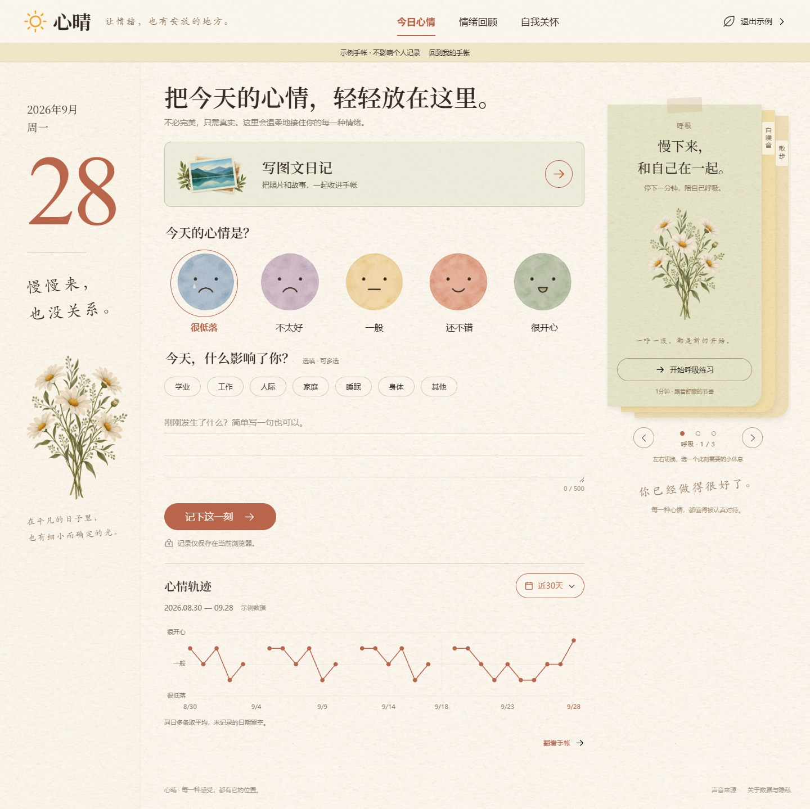
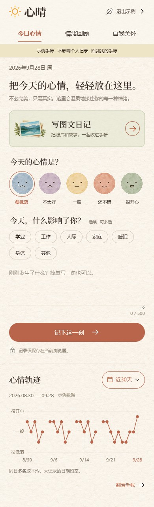
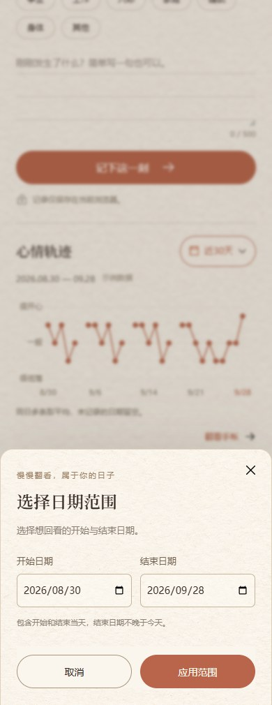
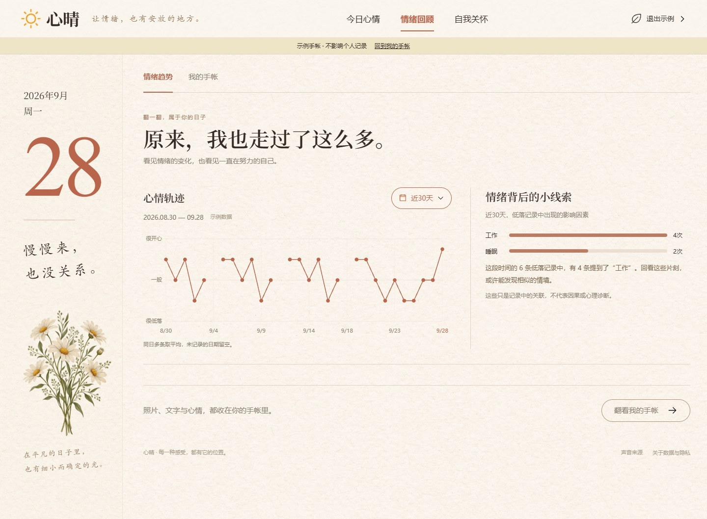

# 心晴 v1.2 · 首页图文入口与心情轨迹 PRD

[项目首页](../README.md) · [完整 PRD](PRD.md) · [照片手帐](PHOTO-JOURNAL.md) · [验收记录](../design-qa.md)

更新：2026-09-28。范围：网页与 Android APK 共用页面。本轮基于用户选定的第五版，保留纸纹、绿色情绪入口与陶土色时间按钮；不增加「先选择记录方式」标题。

## 1. 问题与目标

首页旧图文入口位于保存按钮下方，文字小、按钮感弱。插到心情选择和保存之间又会打断当前填写。趋势固定七天，也无法回看一个月或一次旅行期间。

本轮目标是让两个记录入口清晰，同时保持快速心情记录连续；允许用户主动选择回顾范围，让图表与因素统计使用同一批记录。找入口耗时、使用率和满意度尚未采集，不宣称已经改善这些指标。

## 2. 页面与流程

页面顺序：心晴品牌与导航 → 今日标题 → 绿色「写图文日记」入口 → 心情、因素、短文字、记录按钮 → 心情轨迹。桌面右侧继续显示三张关怀便签；手机按单列自然滚动。

| 操作 | 结果 |
|---|---|
| 点击绿色入口任意位置 | 打开独立图文编辑页，保留原有新建草稿恢复 |
| 从首页进入后取消 / 返回 | 回到首页，保留本次页面会话中未提交的心情、标签和文字 |
| 从影集进入编辑后返回 | 回到原有影集或详情，不改变旧阅读路径 |
| 保存图文日记 | 打开只读详情；填写了有效心情时参与相应日期统计 |
| 直接填写首页心情 | 原五档、七类因素、500 字与保存逻辑继续可用 |

首页未提交短文字只在当前页面会话内保留；刷新恢复的承诺仅属于原有独立图文编辑器草稿，不把两者混为一谈。

## 3. 时间选择

| 选项 | 规则 |
|---|---|
| 近 7 天 | 默认。今天及之前 6 天；回到页面时随设备本地日期滚动 |
| 近 30 天 | 今天及之前 29 天；没有记录的日期保持空白 |
| 自定义日期 | 选择开始和结束，包含两端；可选同一天；不可晚于今天 |

点击日历按钮展开带选中标记的菜单。预设点击即应用；自定义打开日期面板。电脑面板靠近入口且限制在视口内，手机为底部面板，320px 下日期字段上下排列。日期字段调用浏览器 / Android WebView 原生选择器，外观随系统变化。

「应用」校验必填、日期有效性、先后顺序和未来日期；失败给出文字提示且不更新曲线。取消、关闭、点面板外、Escape 或 Android 返回关闭时，保留上次已应用的范围。关闭后焦点返回入口。

选择保存在 `localStorage` 的 `xinqing.trend-range.v1`。无效偏好回落近 7 天；不能写入存储时仍允许当前会话使用。首页、情绪回顾共用这一显示偏好；切换示例只改变数据源。时间筛选不删除记录，也不筛掉影集中的其他日记。

| 手机首页 | 日期面板 |
|---|---|
|  |  |

## 4. 统计与图表口径

1. 用日记的记录日 `day` 聚合；兼容旧记录时才回退创建日期。补记不会错误计入创建当天。
2. 有效心情为整数 1–5；同一天计算算术平均值并显示条数。未填心情的照片日记不计入分子或分母。
3. 按真实日历间隔布点；缺失日期不补值，跨缺失日断线。单日范围将点居中；超长范围仍只聚合实际记录并减少刻度，不为每一天创建节点。
4. 鼠标悬停、点触或键盘左右键可查看记录日、当日均值和条数；Home / End 到首末有记录日。辅助文字提供相同含义。
5. 因素统计只包含同范围心情 1–2 的记录，单条同标签去重；图表范围改变时，因素和范围说明一起更新。关联不解释为因果。
6. 没有有效心情时展示空状态及「换个时间」，不保留上一次范围的曲线或因素；有日记但心情为空也遵循这一规则。

## 5. 可访问性与边界

图文入口是整块原生按钮，含明确名称、圆形箭头和焦点状态。时间入口与选项至少 44px 高，日期输入及确认按钮至少 48px 高。日期面板使用模态 dialog，原有自然声、便签与日记编辑入口继续可键盘操作。

不引入账号、云同步、照片识别、AI 推断、后台跟踪或新的日记存储迁移。新增插画由 Image Gen 生成；文档截图来自隔离示例，未使用私人照片。

## 6. 验收

- 图文入口唯一，位于完整表单之前；顶部没有「先选择记录方式」。
- 7 / 30 天含首尾；跨月、跨年、闰年、单日、空范围、自定义非法输入有明确结果。
- 首页与回顾、因素、日期文案及刷新后的选择一致。
- 图表能点触与键盘查看数据；空范围可换时间；长范围无逐日分配导致的卡顿。
- 320 / 390 / 430 / 640 / 768 / 960 / 1024 / 1440 / 1912px 无横向溢出，菜单和日期控件不出屏。
- 原图文编辑、草稿、备份恢复、多图排列、白噪音和便签交互通过回归。
- Android 包必须包含新版入口插画、时间脚本和样式。浏览器回归与 APK 构建不能替代用户手机上的原生日期选择器、软键盘和返回键验收。
