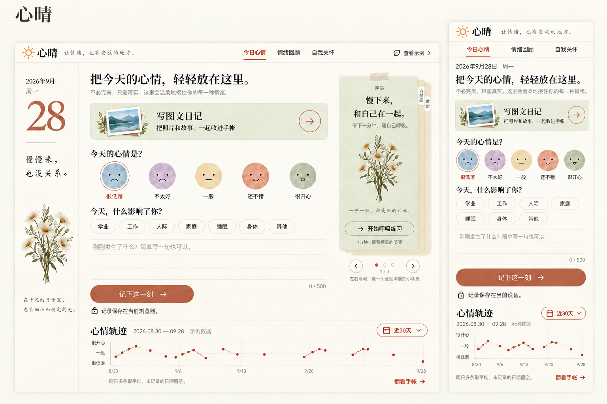

# v1.2：首页图文入口与时间回顾

用户选定第五版后要求：删除「先选择记录方式」，最上方保留心晴。绿色图文入口位于整段心情表单之前，时间使用图二的日历下拉逻辑。本文保留概念依据，实际功能以 [PRD](../../TIME-RANGE.md) 和 [验收](../../../design-qa.md) 为准。

概念由 Image Gen 生成，1536 × 1024。比较时分别裁出左侧电脑区域 `(36,108,1115,995)` 与右侧手机区域 `(1135,54,1501,995)`，移除展示板外标题，不将其当作产品内第二个标题。

实际实现沿用项目原有字体、纸纹、日期侧栏和右叠便签。保留示例模式提示，方便区分演示与个人数据；实际触控区域与正文行距不为塞进单屏而缩小。照片插画为新的透明素材；入口、表单、轨迹的位置关系与选定稿一致。

实际截图：[桌面](../../images/home-v1.2-desktop.jpg)、[手机](../../images/home-v1.2-mobile.jpg)、[时间菜单](../../images/trend-menu-mobile.jpg)、[日期面板](../../images/trend-date-mobile.jpg)。
