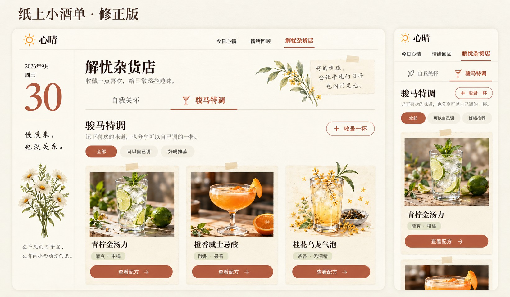
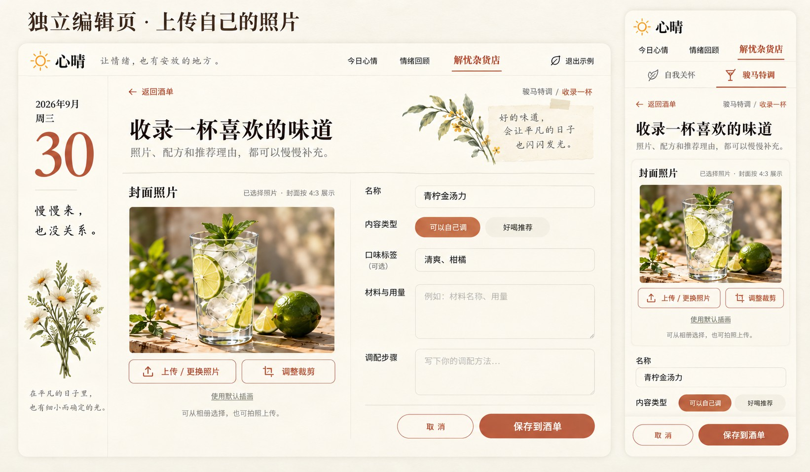
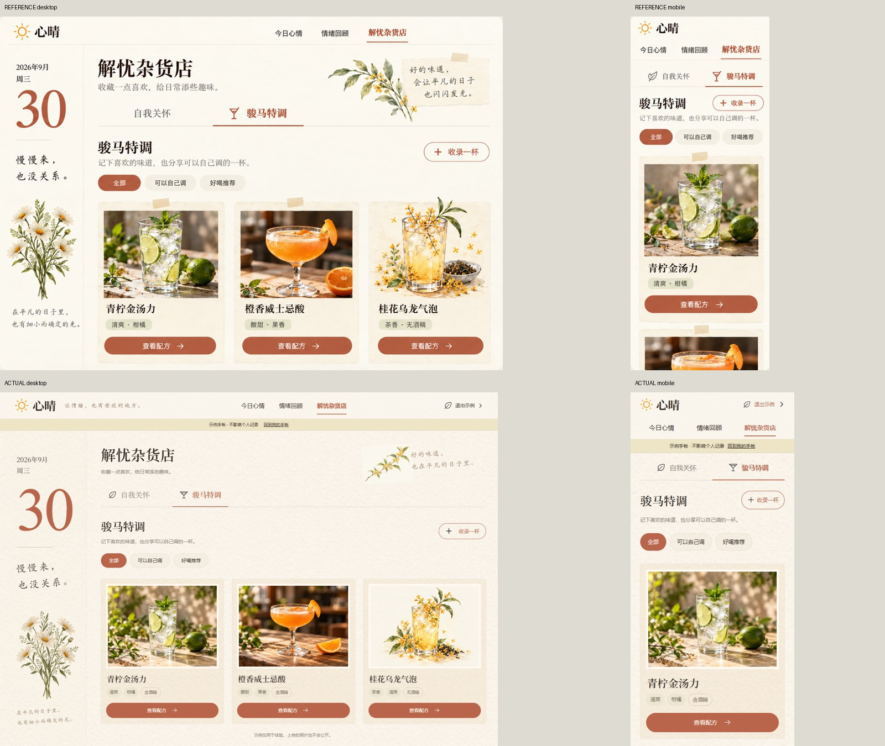
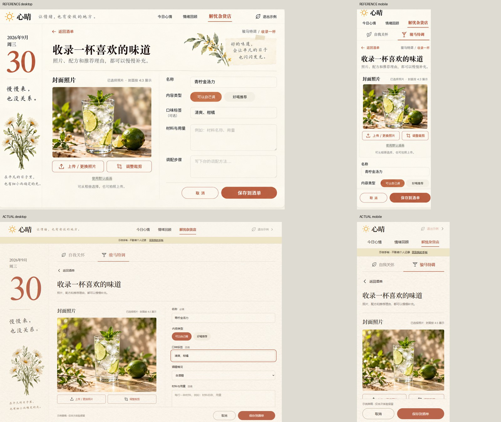

# 解忧杂货店 · 方案一修正版

用户选定「纸上小酒单」，随后明确自我关怀完整归入第一子栏，骏马特调作为第二子栏，酒的配图支持自行上传。实现延续米白纸纹、日期侧栏和陶土按钮。

## 已确认的参考

参考为生成的设计概念，真实可操作界面见 [实际截图](../../images/README.md)。文字、系统字体与素材细节以实现为准。

## 实现对照

保留真实示例状态提示，手机压缩侧栏空间，上传预览和保存操作均可触达。酒单数据沿用本机个人保存方式，不自动公开。详细验收见 [design-qa.md](../../../design-qa.md)。
